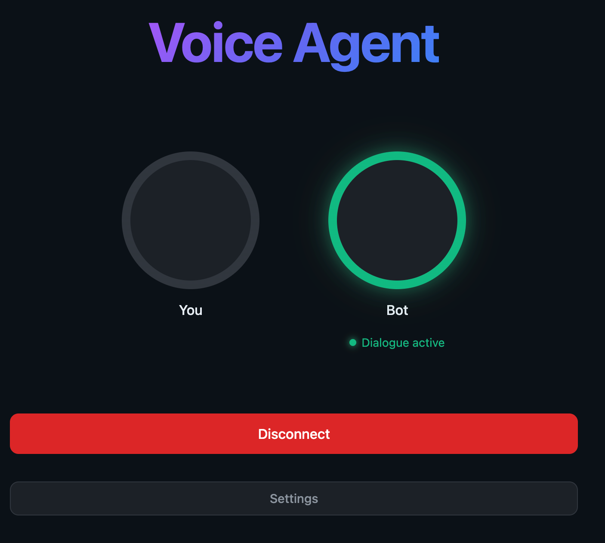

# Voice Agent

AI voice assistant powered by OpenAI Realtime API.



## How It Works

The agent operates in two modes:

1. **IDLE Mode** — Agent listens passively and only activates when it hears its wake word (agent name)
2. **DIALOGUE Mode** — Agent actively participates in conversation, responding to all speech

### Flow

```
User speaks → VAD detects speech → Whisper transcribes → 
Agent checks for wake word → If found, enters DIALOGUE mode →
Agent responds via voice → After 30s of silence, returns to IDLE
```

### Key Features

- **Wake Word Activation** — Say the agent's name (e.g., "Alex") to start a conversation
- **Stop Words** — Say "thanks", "stop", "bye" to end the dialogue
- **Real-time Voice** — Uses OpenAI Realtime API for low-latency voice responses
- **WebRTC Connection** — Direct peer-to-peer audio streaming

### Example Dialogue

```
You: "What's the weather like today?"
[Agent ignores - wake word not detected]

You: "Alex, what's the weather like today?"
Alex: "Let me search for that..."
      [Uses web search tool]
Alex: "It's 72°F and sunny today."

You: "What about tomorrow?"
Alex: "Tomorrow will be partly cloudy with a high of 68°F."
[Agent responds without wake word - already in dialogue mode]

You: "Thanks!"
[Agent exits dialogue mode and returns to passive listening]

You: "Tell me a joke"
[Agent ignores - back in IDLE mode, wake word required]
```

## Requirements

- Modern browser (Chrome, Firefox, Safari, Edge)
- OpenAI API key with Realtime API access
- (Optional) Tavily API key for web search

## Quick Start

### Option 1: Just Open the File

Simply double-click `index.html` to open it in your browser. No server required!

### Option 2: Python

```bash
python -m http.server 8000
```

Open http://localhost:8000

### Option 3: Node.js

```bash
npx serve
```

Open http://localhost:3000

### Option 4: VS Code Live Server

1. Install "Live Server" extension
2. Right-click on `index.html` → "Open with Live Server"

## Usage

1. Enter your OpenAI API key
2. Configure agent name (default: "Alex")
3. Select voice and model
4. Click "Connect"
5. Say the agent's name to start a dialogue

## Tools

- **Web Search** — Search the internet via Tavily API
- **Calculator** — Mathematical calculations
- **Date/Time** — Current date and time

## Configuration

| Setting | Description |
|---------|-------------|
| **Agent Name** | Wake word to activate the agent |
| **Voice** | OpenAI voice (alloy, ash, coral, echo, etc.) |
| **Model** | GPT-4o Mini Realtime or GPT-4o Realtime |
| **Stop Words** | Phrases that end the dialogue |
| **System Prompt** | Instructions for the agent's behavior |

## Files

- `index.html` — Page structure
- `styles.css` — Styling
- `app.js` — Application logic

## Debugging

Open browser Developer Console (F12 or Cmd+Option+I) to see detailed logs:
- Speech detection events
- Transcription results
- Agent mode changes
- API responses

## Technical Details

- Uses WebRTC for real-time audio streaming
- Server VAD (Voice Activity Detection) for speech detection
- Whisper for speech-to-text transcription
- OpenAI Realtime API for voice synthesis
